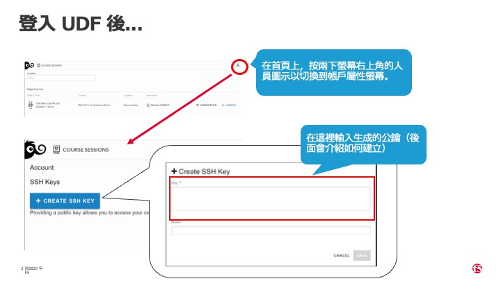
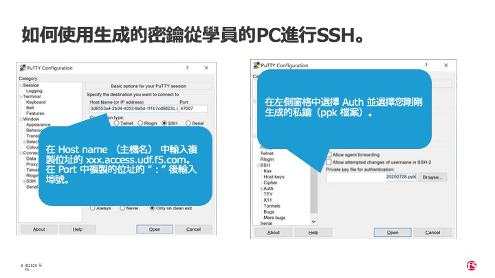
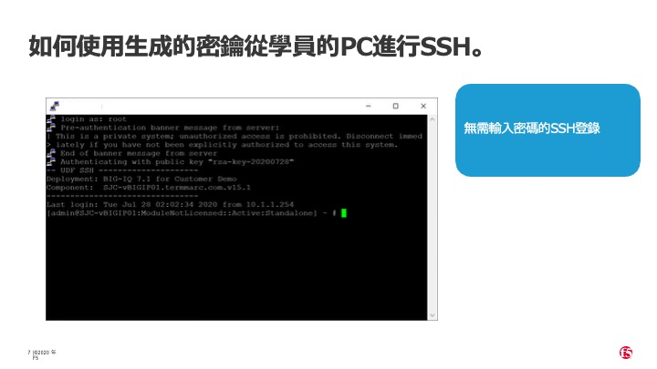

## 目標

* 產生一組 SSH 金鑰或使用現有的金鑰
* 將 SSH 金鑰新增到實驗環境中
* 測試與實驗環境中的 Linux 實例進行 SSH 連線

## 任務 – 將 SSH 金鑰新增到實驗環境

登入 UDF 後，點選右上角的圖示，然後點選「Preferences」以進入偏好設定頁面。

> 

在接下來的頁面中，點選「Create SSH Key」按鈕。

> 

將你的 SSH 公鑰複製並貼上到提供的欄位中。

> 

在 MacOS 上，你可以執行以下指令來產生新的金鑰：

```
ssh-keygen -f ~/.ssh/agility
```

依照提示操作後，將產生的公鑰檔案內容輸出。

將該內容複製並貼上到上述畫面中標示為「Key」的欄位，然後點選「Save」。

接著，嘗試透過 SSH 連線至 External Jump Host。請前往「Components」分頁，並在「Systems」欄位下的 External Jump Host 方框中，使用「Access」下拉選單中的 SSH 選項。

> 

你應該會被提示使用預設的 SSH 應用程式來開啟連線，例如在 MacOS 上的 Terminal 或 iTerm，或在 Windows 上的 PuTTY。







